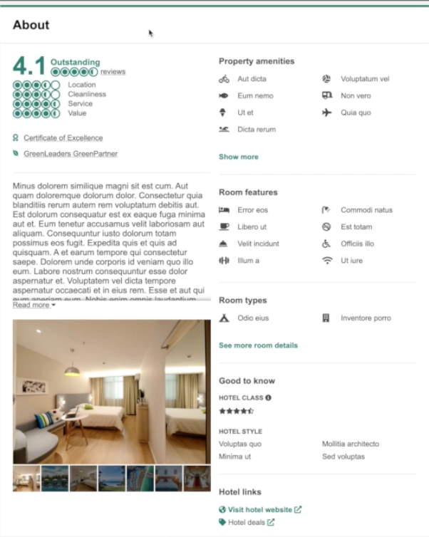

# **About**

## TripAdvisor About Widget

[Video Demonstration](https://youtu.be/C3yamQ65OYQ)

React | Node | Express | MySQL | AWS | CircleCI | Jest

Service-oriented architecture consisting of four microservices delivered by proxy server
- Deployed 7-image carousel, 3 popups, modal with 3 tabs, and 5 ratings via AWS EC2, RDS, and S3
- Provided guidance on Emotion styled components; deployed microservices with 0% CSS conflicts
- Executed 100% of milestones ahead of schedule collaborating remotely on Zoom, Slack, and Trello